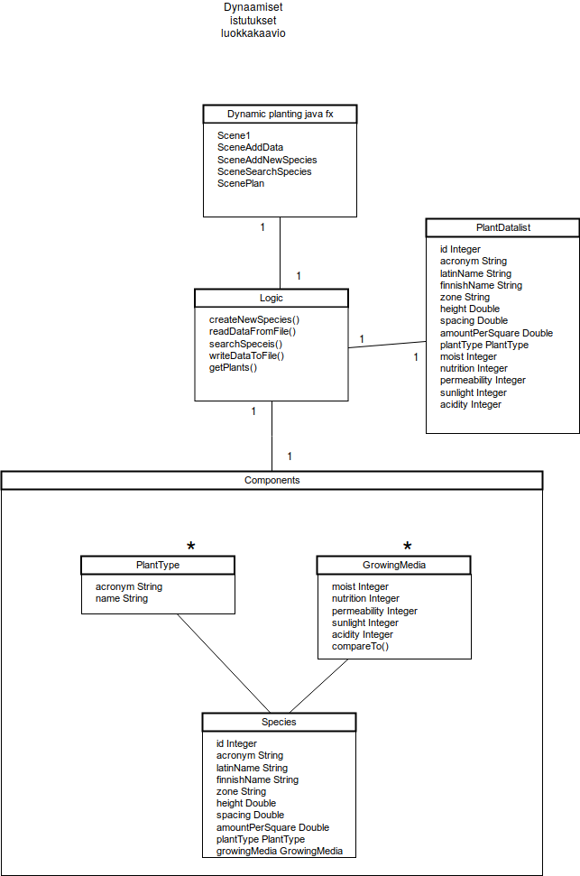
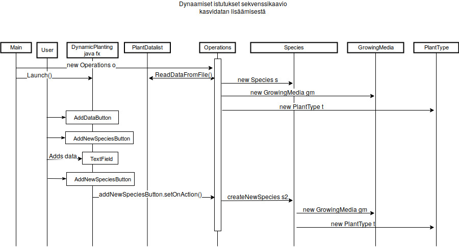
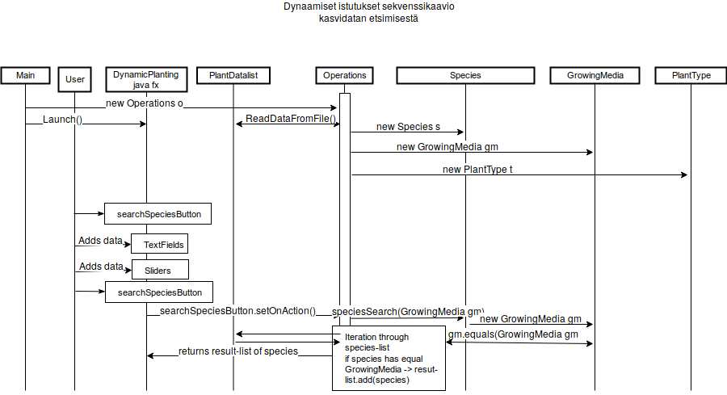

# Software architecture

## User Interface
the user interface consists of 
-   A simple start scene with 2 buttons. One for adding plant data and one for searching plant data.
-   Adding plant data scene, where the user can add new species data with different attributes by filling textfields and gliding sliders.
-   Search scene for searching plant species by filling the known attributes such as the growing media attributes.

## Structure

## Databases / files
-   The data is read from, added and saved to a csv-file called "Pensasluettelo.csv".

# Functions

### Sequence diagram for starting the software and adding a new species 

### Sequence diagram for starting the software and searching for species by certain growing media 

# Flavs
-   The functionality for adding data to an existing species was not complited.
-   The jar file couldn't be run through terminal with the command "java -jar..." There was an error message: "no main manifest attribute, in DynaamisetIstutukset.jar". I couldn't find what it meant.

